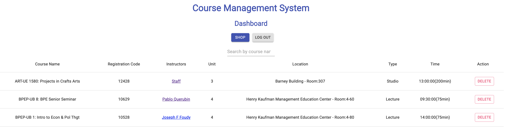
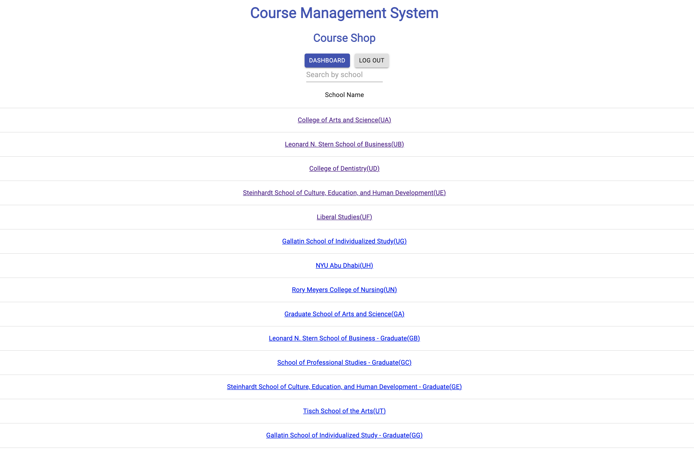
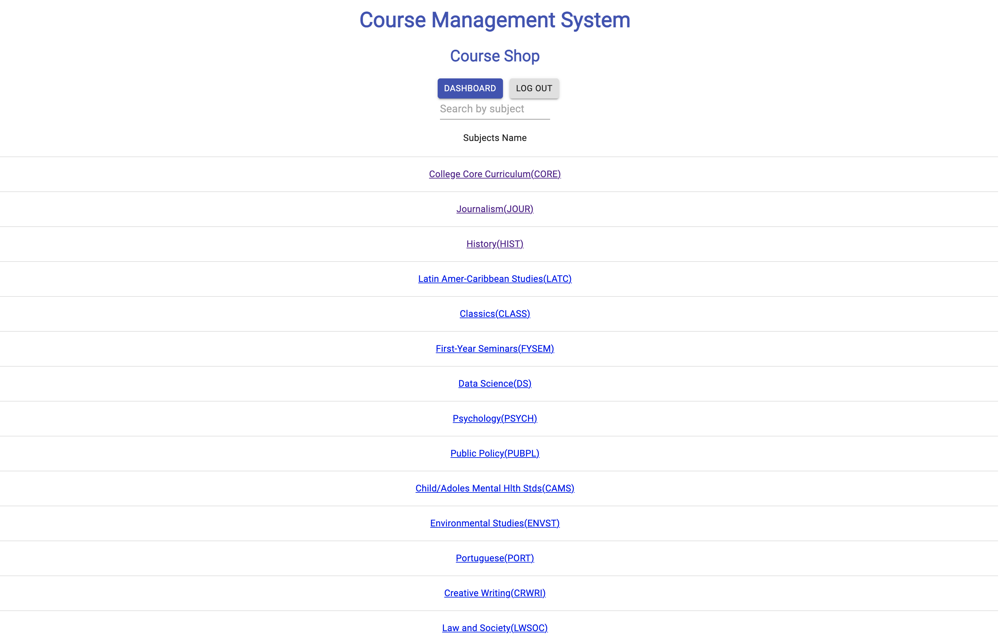
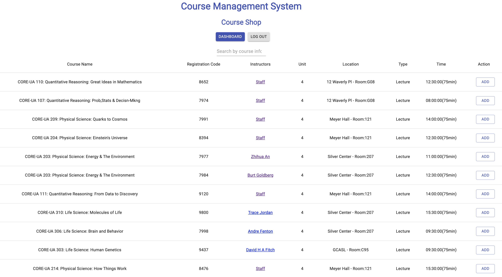

### [Course Management System(click here to try)](https://626ba005750337516f70bbad--luxury-dieffenbachia-ca0d95.netlify.app/) 
[](img/CMS.gif)
##### Backend
- API to register and login user.
- API using which loged in user can add, edit and update it's product.
- Pagination API to give list of perticular user's added product.
- JWT token authentication.

##### Frontend
- Creating a Component in React and creat routing.
- Using react and material UI created form to login user and can register new user.
- Course add and delete also you can search school, subject and course by name.
- Making HTTPS calls using Axios.
- Hyperlink to RateMyProfessor

### Prerequisites
Below noted things you need to install to run this project in your system

- Node.js
- NPM
- MongoDB

### To Setup
Clone or download this repository

1. `cd Course-Management-System/backend`
2. `npm install`
3. `cd Course-Management-System/frontend`
4. `npm install`
5. `modify the config.js in src to the backend server url`

### To Run
To run node server
1. `cd Course-Management-System/backend`
2. `nodemon server.js`

To run react frontend
1. `cd Course-Management-System/frontend`
2. `npm start`


## Overview
This is a course management system(CMS) with real time Albert courses data, you can add,delete,view RateMyProfessor easily through CMS. Your course data will store in MongoDB and can be viewed everywhere at anytime.

## Data Model

The application will store Users, and Courses

* users can have multiple Courses in dashboard
* each course can have multiple infomation


User:

```javascript
{
    userSchema = new mongoose.Schema({
        username: {type: String, required: true},
        password: {type: String},
        courses:  [{ type: mongoose.Schema.Types.ObjectId, ref: 'course' }],
    });
}
```

Course:

```javascript
{
    courseSchema = new mongoose.Schema({
        name:{type: String},
        deptCourseId: {type: String},
        description: {type: String},
        subjectCode: {
            code: {type: String},
            school: {type: String}
        },
        rmpUrl:{type: String},
        registrationNumber: {type: Number},
        code: {type: String},
        instructors: [],
        type: {type: String},
        status: {type: String},
        time: {type: String},
        recitations: [],
        waitlistTotal: {type: Number},
        instructionMode: {type: String},
        campus: {type: String},
        minUnits: {type: Number},
        maxUnits: {type: Number},
        grading: {type: String},
        location: {type: String},
        notes: {type: String},
        prerequisites: {type: String},
        subject:{type: String},
        school:{type: String},
        ID:{type: String}
    });
}
```


## Wireframes


/ - dashboard - page for showing added courses




/shop/school - page for showing schools



/shop/subject - page for showing subjects



/shop/course - page for showing courses




## User Stories or Use Cases


1. as non-registered user, I can register a new account with the site
2. as a user, I can log in to the site
3. as a user, I can open my personal dashboard
4. as a user, I can view and search all courese in the course shop
5. as a user, I can add courses to my dashboard
6. as a user, I can deleted courses from my dashboard


## Annotations / References Used

https://github.com/FSojitra - MERN-Stack